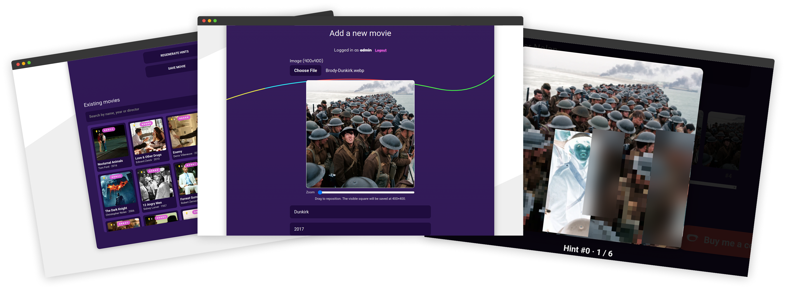

# 🎬 Frame Guesser

An interactive movie-frame guessing game built with **Django REST API + SvelteKit frontend**.

Players receive progressively clearer image hints, pick the correct movie option, and score points based on both difficulty and how quickly they answer.

---

## ✨ General overview of features

- User registration/login with JWT authentication
- Session-based gameplay with multiple frames per run
- Progressive hints per frame (request next hint anytime)
- Scoring based on hint usage + frame difficulty
- Leaderboard/home feed with users + feedback messages
- End-of-run report with points, accuracy, and average comparison
- Admin upload tools for frames (single batch or zip bundles)

## 🏗️ Infrastructure & Tech Stack

- **Backend:** Django and Django REST Framework provide the API, with JWT-based authentication.
- **Database:** MySQL, accessed through Django's ORM.
- **Frontend:** SvelteKit with Svelte 5 and TypeScript.
- **Development and deployment:** Docker Compose configurations are provided for development and production. A dedicated Dockerfile supports deploying the backend to Railway.
- **Frame generation:** Standalone Python scripts generate progressive image hints using OpenCV and a YOLO11n ONNX model.

## 🖼️ Frame generation pipeline (AI model)

The utility in `scripts/frames/image_gen.py` can generate multiple hint images from source frames by applying progressive visual transformations (blur/pixelate/negative) and exporting zip bundles.

The pipeline works in two steps:

- Detect prominent regions in the frame, such as objects, people, and faces, using YOLO11n ONNX.
    - As the smallest model in the YOLO11 family, it runs quickly on a CPU with a modest memory footprint and can identify the main subjects in a movie still.
    - Inference uses `cv2.dnn.readNetFromONNX` with the CPU target. Hint generation requires OpenCV (`opencv-contrib-python-headless`), but not `torch`, `ultralytics`, or CUDA drivers, keeping the backend image smaller and easier to deploy.
- Apply progressively stronger obfuscation to the detected regions.

The script is available through a dedicated page, so staff can add movies without using the command line.

- Log in as a staff account directly on the page.
- Upload a source image and use the built-in 400×400 cropper (drag + zoom) to frame it.
- Click **GENERATE HINTS** — the backend runs the image through the AI pipeline described above and streams the hint set back for preview.
- Click **REGENERATE HINTS** to run the pipeline again on the same crop and produce different obfuscation effects.
- Enter the movie's title, year, and director, then save the movie.
- Browse existing movies in list or grid view, with search and difficulty and hint-count badges to help avoid duplicates.

## 📸 Screenshots

